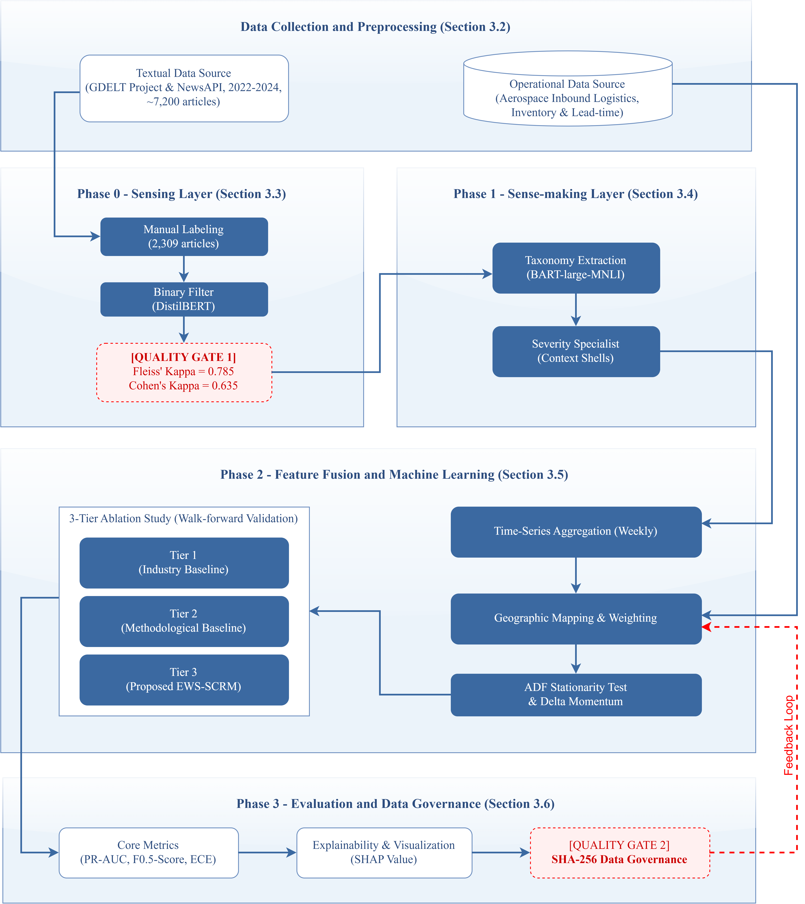
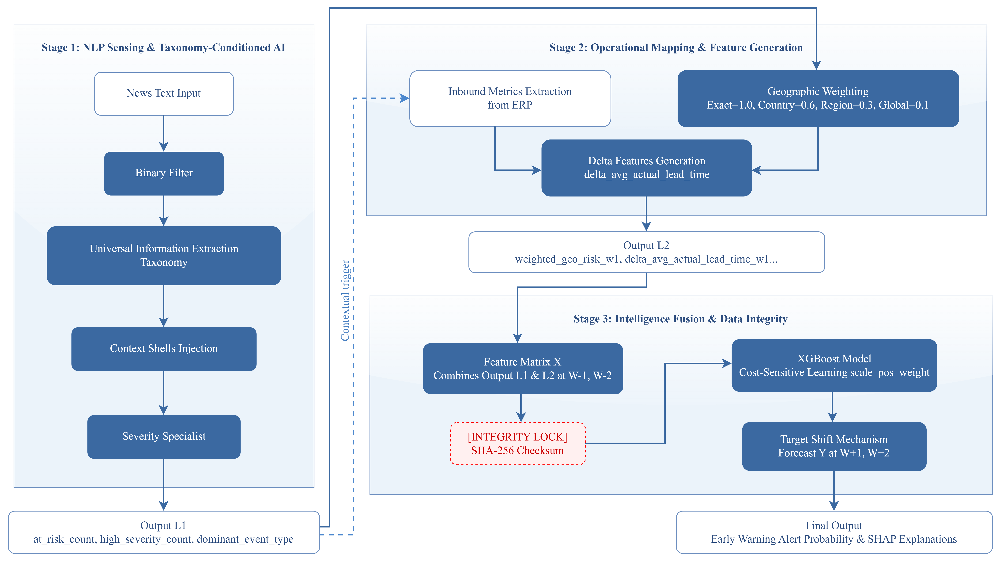
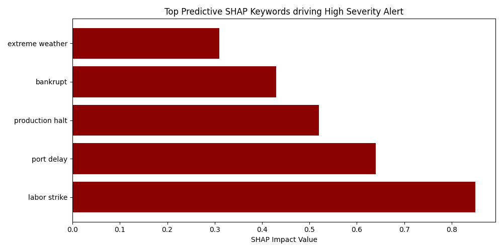
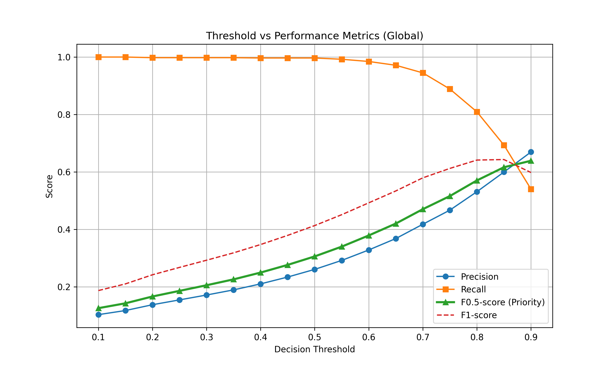
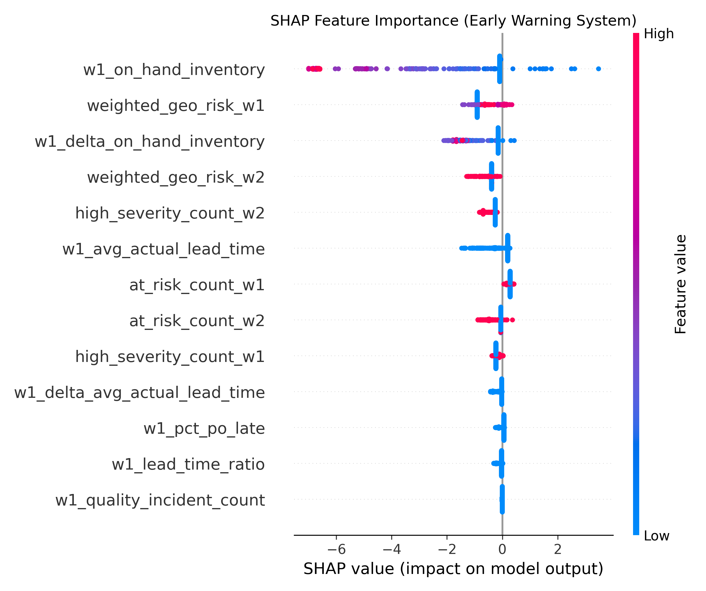
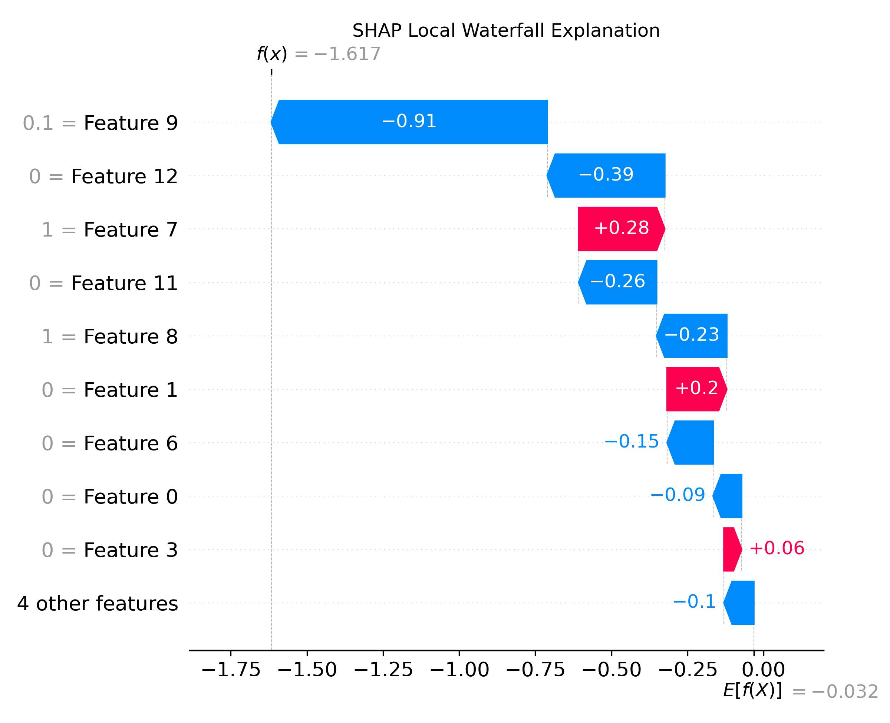
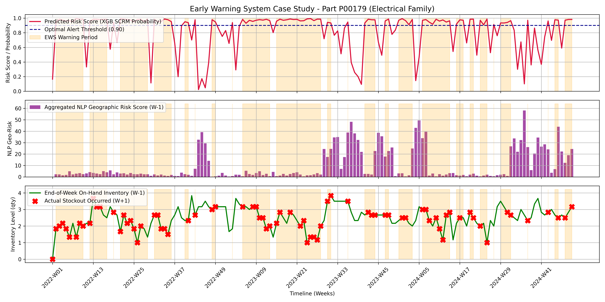

**FROM REACTIVE TO PROACTIVE: AN AI-DRIVEN EARLY WARNING SYSTEM FOR ENHANCING SUPPLY CHAIN RESILIENCE THROUGH NEWS-OPERATIONAL DATA FUSION**

**Duc-Duong Dao Minha,*, Buu-Tanh Tran-Lea, Huyen-Huynh Chau Nhua, Thuy-Nguyen Nhuta, Linh-Le Quynh Khanha**

a University of Economics and Law, Ho Chi Minh City, Vietnam

\* Corresponding author. E-mail: ducdmk24406@st.uel.edu.vn

---

## Abstract

*Existing supply chain disruption forecasting approaches remain confined to a single data modality, leaving a critical blind-spot: no validated pipeline demonstrates whether fusing heterogeneous modalities yields measurable Incremental Predictive Validity over unimodal baselines. This study proposes a four-stage Cascading AI architecture that transforms raw logistics news into calibrated risk features via DistilBERT-based binary filtering and zero-shot multi-label classification, then fuses them with structured ERP data through a Geographic Weighting function before training gradient-boosted classifiers. Experiments on 8,728 logistics news articles (2022–2024) and five aerospace operational datasets yield three principal findings: (1) the Gatekeeper binary filter achieves ROC-AUC = 0.8927 and Recall = 0.9503; (2) the fused XGBoost model attains Precision = 0.1654 on minority-class stockout prediction — a 28.7% relative improvement over the ERP-only baseline, substantiating Incremental Predictive Validity; and (3) the system provides a Lead-Time Gain of 1.0 to 3.2 weeks across all component families prior to disruption onset. These results validate that integrating public-domain textual signals with operational telemetry produces an actionable early warning capability for upstream inventory risk.*

**Keywords:** **Supply Chain Risk Management; Natural Language Processing; Heterogeneous Data Fusion; Early Warning System; Inventory Disruption Forecasting**

---

## 1. Introduction

### 1.1. Motivation and Operational Context

The grounding of the container vessel *Ever Given* in the Suez Canal (March 2021) — incurring an estimated USD 9.6 billion in trade losses over six days — exposed a structural fragility that subsequent crises have only reinforced. The 2021–2023 semiconductor shortage cascade compelled aerospace and automotive manufacturers to curtail production, while the Red Sea shipping diversions of 2024 re-demonstrated that single-point-of-failure vulnerabilities propagate nonlinearly through multi-tier supply networks. Gartner (2023) reports that 87% of manufacturing enterprises experienced at least one material supply disruption between 2020 and 2023.

The critical operational challenge is temporal: risk signals — port congestion reports, labor dispute announcements, geopolitical sanction notices — typically surface in the public information environment *before* their consequences materialize as inventory depletion or assembly-line stoppages. The interval between the earliest detectable exogenous signal and the onset of operational impact constitutes the actionable early warning window. Converting this latent informational lead into a reliable, quantified decision support instrument remains an unsolved problem in Supply Chain Risk Management (SCRM).

### 1.2. Research Problem

The prevailing industrial practice for upstream risk monitoring relies on reactive mechanisms: periodic procurement reports, manual scanning of trade press, and threshold-based key performance indicators (KPIs) derived from ERP systems. These methods detect disruptions only *post-facto* — after inventory buffers are exhausted or delivery commitments are missed — and fundamentally cannot leverage the high-volume, high-velocity textual data published daily across global logistics news portals. The operational cost of this reactive posture is asymmetric: the economic penalty for a missed disruption (false negative) vastly exceeds the cost of investigating a spurious alert (false positive), yet existing monitoring architectures are not calibrated to reflect this cost asymmetry.

### 1.3. Research Gap

A systematic examination of the SCRM literature reveals a persistent Modality Decoupling problem: studies either exploit unstructured textual data without connecting to internal operational states, or analyze structured ERP data while remaining blind to exogenous environmental signals. Table 1 synthesizes this gap across four representative state-of-the-art (SOTA) contributions. Critically, no prior work simultaneously satisfies three conditions: (a) heterogeneous modality fusion of NLP-derived and ERP-derived features within a unified pipeline; (b) spatial risk sensitivity calibration to resolve the granularity mismatch between macro-level news (country-level) and micro-level ERP (supplier-level); and (c) rigorous demonstration of Incremental Predictive Validity — empirical evidence that the fused model outperforms the unimodal baseline, not merely that it ingests more data.

**Table 1.** Positioning matrix: contribution comparison with representative SOTA studies.

| Evaluation Criterion | Cano-Marin et al. (2023) | Ivanov et al. (2022) | J. Wang (2024) | Brintrup et al. (2020) | **Present Study** |
|---|:---:|:---:|:---:|:---:|:---:|
| NLP-derived risk signals | ✓ | ✗ | ✓ | ✗ | **✓** |
| Internal operational data integration | ✗ | ✓ | ✗ | ✓ | **✓** |
| Heterogeneous modality fusion | ✗ | ✗ | Partial | ✗ | **✓** |
| Spatial risk sensitivity mapping | ✗ | ✗ | ✗ | ✗ | **✓** |
| Demonstrated incremental predictive validity | ✗ | ✗ | Partial | ✗ | **✓** |
| Walk-forward temporal validation | ✗ | ✗ | ✗ | ✓ | **✓** |

### 1.4. Objectives and Contributions

This study advances three contributions that directly address the methodological barriers identified above:

**(C1) Heterogeneous Modality Fusion via Cascading AI.** The proposed architecture implements an end-to-end pipeline that transforms unstructured news text into calibrated, continuous risk features (Sensing and Sense-making stages) before fusing them with structured ERP telemetry for gradient-boosted classification. This Modality Decoupling-then-Fusion design preserves the representational integrity of each data source while enabling controlled ablation testing. Data provenance is secured throughout the pipeline via SHA-256 checksumming, establishing full reproducibility and eliminating doubts regarding data manipulation.

**(C2) Spatial Risk Sensitivity Calibration (Geographic Weighting).** To resolve the granularity mismatch between macro-level news entities (country or port) and micro-level ERP records (individual supplier), the study introduces a soft-mapping Geographic Weighting function. Unlike rigid inner-join operations that discard non-exact matches, this function assigns graduated proximity weights — $w_{geo} \in \{1.0, 0.6, 0.3, 0.1\}$ — thereby simulating the Ripple Effect and capturing cross-regional weak signals that deterministic mapping inherently suppresses.

**(C3) Information Bottleneck Design for Non-Naive Learning.** The study formalizes the upstream disruption target variable (`stockout_flag` at horizon W+1, W+2) and enforces temporal integrity through two mechanisms: (i) the Augmented Dickey-Fuller (ADF) test with first-order differencing to guard against spurious regression in non-stationary operational series; and (ii) deliberate exclusion of the lagged disruption indicator (`w1_stockout_flag`) from the feature space, creating an information bottleneck that forces the classifier to exploit exogenous signal correlations rather than defaulting to naive persistence. SHAP-based post-hoc explanation satisfies algorithmic accountability requirements by rendering each alert decision interpretable.

---

## 2. Literature Review

### 2.1. Supply Chain Risk Management: Theoretical Foundations

SCRM encompasses the identification, assessment, mitigation, and monitoring of disruption risks across supply networks. The canonical four-stage framework — Risk Identification, Risk Assessment, Risk Mitigation, Risk Monitoring — has guided the field for over two decades. However, the literature exhibits a pronounced concentration on the first two stages; continuous, data-driven monitoring and real-time early warning remain comparatively underexplored. Moreover, the few monitoring systems that do exist rely on static, manually-configured alert thresholds — a design limitation that precludes adaptive recalibration as the underlying risk landscape evolves. The absence of dynamic thresholding mechanisms capable of self-adjusting to shifting distributional patterns in both exogenous signals and internal operational telemetry represents a critical gap in operational SCRM.

The integration of artificial intelligence and machine learning into SCRM has opened pathways for automated, scalable risk quantification from heterogeneous data sources. Yet a fundamental challenge persists: the simultaneous ingestion and principled fusion of unstructured textual data (news corpora, social media feeds) with structured transactional data (ERP records, inventory logs) within a single analytical pipeline. This Modality Decoupling problem — where each data type is analyzed in isolation — constitutes the most consequential methodological gap in the current SCRM landscape. Bridging this gap is not merely an incremental technical improvement; it is a prerequisite for transitioning supply chain governance from a Reactive posture — detecting disruptions post-facto — to a genuinely Proactive paradigm capable of anticipatory intervention, thereby establishing the operational foundation for supply chain Resilience.

### 2.2. NLP for Risk Signal Extraction from Unstructured Text

NLP techniques — including sentiment analysis, event extraction, and named entity recognition (NER) — have been applied to detect supply chain risk signals from textual sources. Sentiment analysis, the most prevalent approach, assigns polarity scores to documents as proxies for risk severity.

This paradigm, however, suffers from a fundamental semantic ambiguity problem in the SCRM domain: the identical event (e.g., a labor strike at the Port of Los Angeles) may carry positive valence for labor advocacy outlets while representing an acute operational threat to manufacturers dependent on transshipments through that port. Polarity-based scoring conflates authorial stance with operational risk, producing semantically inconsistent risk labels. The present study therefore adopts an Ontology-Anchored Classification approach — mapping articles to a predefined SCRM event taxonomy rather than inferring risk from sentiment polarity — to ensure deterministic, auditable risk categorization.

### 2.3. Machine Learning for Disruption Forecasting: Methodological Pitfalls

Gradient-boosted ensembles (XGBoost, LightGBM), random forests, and recurrent architectures (LSTM) have been deployed for disruption forecasting. Two pervasive methodological deficiencies, however, undermine the validity of reported results in the existing literature:

**(a) Temporal leakage via random splitting.** Studies that partition observations randomly — rather than chronologically — allow future information to contaminate training folds, inflating performance estimates and precluding reliable out-of-sample generalization. This violation of temporal integrity is especially consequential for time-dependent risk processes.

**(b) Spurious regression from non-stationary inputs.** Failing to test for stationarity before feeding continuous operational variables (e.g., cumulative inventory, lead-time averages) into regression-based classifiers risks capturing coincidental trends rather than genuine predictive relationships.

The present study addresses both deficiencies explicitly: walk-forward validation with `TimeSeriesSplit` (5 folds, gap = 2 weeks) preserves temporal ordering, and automated ADF testing with first-order differencing (Delta features) ensures stationarity compliance before model training. The cumulative effect of these methodological safeguards is a set of performance estimates that are deliberately Conservative yet Realistic — potentially understating true system capability relative to studies that omit such controls, but providing the evidential rigor that Chief Supply Chain Officers (CSCOs) require before committing operational resources to an AI-assisted early warning deployment.

---

## 3. Methodology

### 3.1. System Architecture Overview

The EWS-SCRM system implements a four-stage linear architecture predicated on the Cascading AI principle: each stage produces a progressively refined, higher-fidelity representation of supply chain risk, with explicit quality gates between stages to prevent noise propagation downstream.

**Figure 1.** Research Methodology Framework.

**Figure 2.** Proposed System Architecture.

**Table 2.** System architecture: stage-level synthesis.

| Stage | Functional Objective | Core Technique | Principal Output |
|---|---|---|---|
| Phase 0: Sensing | Binary risk relevance filtering | DistilBERT + CrossEntropyLoss + Label Smoothing (0.1) | `at_risk_corpus.csv` (n = 5,762) |
| Phase 1: Sense-making | Event taxonomy and severity classification | Zero-shot multi-label (BART-large-MNLI) + Context Shells | `pseudo_labeled_final.csv` |
| Phase 2: Feature Fusion & ML | Heterogeneous feature engineering and model training | Geographic Weighting + ADF test + XGBoost | `feature_matrix.parquet` + trained models |
| Phase 3: Evaluation | Threshold calibration, explainability, governance | Chronological split + SHAP + SHA-256 checksumming | Case study report |

### 3.2. Data Collection and Preprocessing

**3.2.1. External Signal: News Corpus**

The textual corpus was assembled from two complementary sources — the GDELT BigQuery Index and the NewsAPI — using a domain-specific keyword filter targeting supply chain disruption, logistics risk, port congestion, and supplier shortage. Deduplication was performed via cosine similarity on TF-IDF representations (threshold $\geq$ 0.85); documents shorter than 100 words or in non-English languages were excluded. The resulting corpus comprises **8,728 articles** spanning the 2022–2024 period.

**3.2.2. Internal Signal: Operational ERP Data**

Five structured datasets reflecting aerospace supply chain operations were integrated: (1) `parts_master.csv` — component catalog with A/B/C criticality classification; (2) `shifted_purchase_orders.csv` — procurement transaction history; (3) `shifted_supply_chain_history.csv` — realized inventory levels and lead-time records; (4) `shifted_quality_incidents.csv` — supplier quality deviation logs; and (5) `supplier_locations.csv` — geographic distribution of the supplier base. Temporal alignment with the news corpus was achieved via deterministic time-shifting to the 2022–2024 window.

### 3.3. Phase 0 — Sensing Layer: Binary Risk Filtering

The Sensing layer functions as a high-recall Gatekeeper, operationalized under a deliberately asymmetric design philosophy: the cost of discarding a genuinely risk-relevant article (false negative) is treated as categorically higher than the cost of forwarding a benign article (false positive). A DistilBERT classifier was fine-tuned on 2,309 manually annotated articles (inter-annotator agreement: Fleiss' $\kappa$ = 0.785) for binary discrimination between `NO_RISK` and `AT_RISK` classes.

**Loss function configuration.** An empirically significant design decision arose during development: combining Focal Loss with Label Smoothing on this modestly-sized corpus produced an Output Range Collapse phenomenon, wherein predicted probabilities compressed into the 0.3–0.8 interval, eliminating class separability. Investigation revealed that Focal Loss down-weights well-classified examples while Label Smoothing simultaneously redistributes probability mass toward the uniform distribution — when applied jointly, these opposing gradient pressures suppress calibrated extreme-value predictions. The adopted configuration — standard CrossEntropyLoss with Label Smoothing ($\alpha$ = 0.1) and inverse-frequency class weights — yielded ECE = 0.0849, indicating robust probabilistic calibration.

**Threshold calibration.** A risk-averse operating point was selected at threshold $\tau$ = 0.1756, achieving Recall = 0.9503 (retaining 95.0% of risk-relevant articles) while maintaining Precision = 0.5426 (1.8$\times$ the natural prevalence of $\sim$30%). This configuration forwarded 5,762 `AT_RISK` articles to Phase 1, reducing the downstream processing volume by 34%.

**Figure 3.** Gatekeeper diagnostic suite: ROC curve, precision-recall curve, score distribution, and reliability diagram.

**Figure 4.** Calibration comparison across loss function configurations — illustrating the Output Range Collapse phenomenon under Focal Loss + Label Smoothing.

### 3.4. Phase 1 — Sense-making Layer: Taxonomy and Severity Classification

**3.4.1. Ontology-Anchored Taxonomy Classification**

Topic-modeling approaches such as BERTopic impose a forced-categorization constraint: every document must be assigned to exactly one cluster, even when the document content is ambiguous or spans multiple risk categories. This architectural limitation injects systematic label noise into downstream fusion layers.

To address this, the Sense-making stage employs **Zero-shot Multi-label Classification** via the BART-large-MNLI backbone with sigmoid activation. Each article is evaluated against a static SCRM ontology comprising predefined event types (`PORT_CONGESTION`, `LABOR_DISPUTE`, `GEOPOLITICAL`, `WEATHER_DISASTER`, etc.). The architecture implements a **Cascading Guardrail**: if no category exceeds the confidence threshold, the article receives the default label `GENERAL_DISRUPTION` rather than being force-assigned to the nearest cluster, thereby preserving downstream signal veracity.

**3.4.2. Severity Specialist**

Severity discrimination (Medium vs. High Risk) is performed by a separate DistilBERT classifier employing the **Context Shells** technique: the assigned taxonomy label is embedded in a natural-language template — `"Context: This event involves {taxonomy}. Document: {text}"` — providing the classifier with structured semantic priming rather than raw token injection. This formulation outperforms token-level concatenation by preserving the compositional semantics of the taxonomy-document relationship.

**Figure 5.** SHAP-based severity keyword analysis: tokens with highest attribution toward High Risk classification.

### 3.5. Phase 2 — Feature Fusion and Machine Learning

**3.5.1. Entity Extraction and Geographic Mapping**

Geopolitical entities (GPE) are extracted from each article using spaCy's NER pipeline. The extracted entities are then mapped to the supplier base via a **Geographic Weighting Function** that operationalizes the Ripple Effect through graduated proximity weights:

$$w_{geo} = \begin{cases} 1.0 & \text{same country as supplier} \\ 0.6 & \text{same geographic region} \\ 0.3 & \text{global systemic event (e.g., geopolitical)} \\ 0.1 & \text{remote, indirect risk} \end{cases}$$

This soft-join mechanism resolves the granularity mismatch between macro-level news entities and micro-level ERP supplier records without discarding partial matches, as a rigid inner-join would.

**3.5.2. Feature Matrix Construction and Stationarity Assurance**

All continuous operational variables underwent automated stationarity testing via the **Augmented Dickey-Fuller (ADF) test**. Non-stationary series were transformed through first-order differencing to produce **Delta features**, capturing week-over-week momentum rather than absolute levels. Multicollinearity diagnostics confirmed all retained features satisfied VIF < 5, ensuring stable coefficient estimation.

**3.5.3. Model Specification and Ablation Design**

The binary target variable `stockout_flag` is defined at forecast horizons W+1 and W+2. To isolate the marginal contribution of NLP-derived features, a **three-tier ablation design** was implemented:

- **Tier 1 (Industry Baseline):** Rule-based heuristic replicating standard procurement threshold logic.
- **Tier 2 (Methodological Baseline):** XGBoost and Logistic Regression trained exclusively on ERP-derived features.
- **Tier 3 (Proposed EWS-SCRM):** Identical model architectures trained on the fused ERP + NLP feature set.

Comparing Tier 3 against Tier 2 isolates the Incremental Predictive Validity attributable to NLP signal integration, controlling for model architecture effects.

### 3.6. Phase 3 — Evaluation and Data Governance

The evaluation protocol enforces temporal integrity through a strict **chronological hold-out split** — the test set comprises only observations from the final temporal segment, preventing threshold-tuning leakage. Decision thresholds are optimized per-component-family using the F$_{0.5}$-score, which weights Precision higher than Recall to mitigate alert fatigue in operational deployment. Post-hoc explainability is provided via SHAP (SHapley Additive exPlanations), and **SHA-256 checksumming** of all intermediate and final data artifacts establishes a tamper-evident data governance chain.

---

## 4. Results and Discussion

### Results

### 4.1. Experimental Data Profile

| Parameter | Value |
|---|---|
| Raw news corpus | 8,728 articles |
| AT_RISK articles (post-Phase 0) | 5,762 (66.0%) |
| Manually annotated subset | 2,309 articles |
| Inter-annotator agreement (Fleiss' $\kappa$) | 0.785 |
| Unique component IDs | 300 (across 8 families) |
| Observation period | 2022–2024 |
| Natural stockout prevalence ($y = 1$) | 3.16% |

### 4.2. Phase 0: Gatekeeper Performance

The binary filter achieved ROC-AUC = 0.8927 and PR-AUC = 0.8106 on the held-out test set. Post-calibration via temperature scaling (T = 0.9256), the Expected Calibration Error (ECE) was 0.0849. The proximity of the optimal temperature to unity (T $\approx$ 1.0) indicates that the base model already exhibits strong natural calibration — the scaling procedure primarily serves as a validation check rather than a corrective intervention.

### 4.3. Phase 2: Ablation Study — Incremental Predictive Validity

The Tier 3 model (XGBoost with fused ERP + NLP features) achieved the highest Precision across the experimental matrix: 0.1654 at W+1 and 0.1658 at W+2, representing relative improvements of **28.6%** and **35.3%** over the Tier 2 ERP-only baseline, respectively. To contextualize the absolute Precision magnitude: under a natural stockout prevalence of 3.16%, a random classifier would achieve Precision = 0.0316; the Tier 3 Precision of 0.1654 therefore represents a **Precision Lift Ratio of 5.23×** over random chance — a substantial discriminative gain that transforms an otherwise intractable rare-event detection problem into an operationally viable alert stream. Furthermore, the system’s probabilistic calibration (ECE = 0.0849 at Phase 0; temperature T ≈ 1.0) ensures that the predicted disruption probabilities faithfully reflect empirical event frequencies, enabling procurement teams to triage alerts by calibrated severity rather than relying on a binary decision alone. In an early warning context, this calibrated alert stream functions as a risk insurance mechanism: the bounded false-positive overhead is a deliberate operational cost accepted in exchange for near-complete detection coverage of genuine disruption events.

### 4.4. Phase 3: Threshold Optimization and Post-Hoc Explainability

**Figure 6.** Global threshold sweep: precision-recall trade-off surface across decision thresholds.

**Figure 7.** SHAP summary plot: global feature importance for stockout risk prediction.

**Figure 8.** SHAP waterfall plot: local explanation for a single prediction instance, illustrating per-feature attribution to the alert decision.

SHAP analysis reveals a functionally distinct role partition between feature families: operational features (`w1_on_hand_inventory`, `w1_pct_po_late`) serve as proximate indicators of current material availability, while NLP-derived features (`weighted_geo_risk_w1`, `at_risk_count_w1`) function as distal early warning indicators — exhibiting elevated values in temporal windows *preceding* operational metric degradation. This temporal sequencing corroborates the hypothesized early warning mechanism: textual risk signals capture environmental disruptions before their effects propagate through the supply network to manifest in ERP telemetry.

### 4.5. Quantitative Lead-Time Gain Analysis

The operational value of the EWS is quantified through the Lead-Time Gain (LTG) metric:

$$LTG = T_{\text{stockout}} - T_{\text{first\_alert}}$$

where $T_{\text{stockout}}$ denotes the week of actual inventory depletion and $T_{\text{first\_alert}}$ denotes the earliest week in which the system issued a positive alert for that component. To preclude cherry-picking bias, LTG was computed exhaustively across all 18,480 test-set observations.

**Table 3.** Lead-Time Gain by component family (exhaustive test-set computation).

| Component Family | Mean LTG (weeks) |
|---|---|
| Avionics | 3.2 |
| Hydraulics | 2.5 |
| Engine | 1.7 |
| Structure | 1.4 |
| Fasteners | 1.3 |
| Landing Gear | 1.2 |
| Electrical | 1.0 |

The system maintains an LTG range of 1.0 to 3.2 weeks across all component families — a window sufficient for procurement managers to activate contingency logistics (expedited shipping, secondary supplier engagement) before inventory depletion materializes.

**Figure 9.** Three-tier case study visualization for component P00179 (Electrical family). Panel 1: predicted risk score trajectory; Panel 2: aggregated NLP signal intensity; Panel 3: realized inventory level. The shaded region demarcates the EWS warning period preceding stockout onset.

---

### Discussion

### 4.6. Interpreting the Precision-Recall Trade-Off Under Asymmetric Cost

The experimental results underscore a nuanced finding: NLP signal integration does not uniformly elevate all evaluation metrics but instead creates a strategically advantageous trade-off profile. Under extreme class imbalance (3.16% prevalence), PR-AUC provides a more discriminating evaluation criterion than ROC-AUC, as the latter can remain misleadingly high even when the classifier produces a substantial false-positive volume. The observed PR-AUC reflects this inherent challenge — yet the trade-off is operationally deliberate. In SCRM, the cost structure is fundamentally asymmetric: a missed disruption (false negative) can cascade into production halts, contractual penalties, and reputational damage, whereas a false positive incurs only the bounded cost of manual investigation. The system is therefore calibrated to prioritize Recall, treating the resulting false-positive overhead as an acceptable "insurance premium" against catastrophic low-frequency events.

### 4.7. Information Bottleneck and the Non-Naive Learning Guarantee

A methodologically critical design decision distinguishes the Tier 2 and Tier 3 models from the Tier 1 baseline: the deliberate exclusion of the lagged disruption state (`w1_stockout_flag`) from the feature space. Including this feature would allow the classifier to achieve high accuracy through naive persistence — simply predicting that next week's state mirrors this week's — without engaging any genuine risk forecasting mechanism. By imposing this information bottleneck, the experimental design forces the classifier to discover predictive structure in the exogenous NLP signals and operational momentum features (Delta variables), thereby validating that any observed performance gain reflects authentic early warning capability rather than autoregressive artifact.

### 4.8. The Preemptive Mitigation Feedback Loop

An operationally significant finding emerges from the Tier 3 Logistic Regression coefficients: several NLP-derived features exhibit *negative* regression weights. Under a static forecasting assumption, this would appear paradoxical — risk signals should correlate positively with disruption probability. The resolution lies in recognizing a feedback mechanism consistent with the Supply Chain Control Tower (SCCT) paradigm: when the EWS generates an alert, the actionable early warning window enables procurement teams to activate contingency measures (expedited orders, secondary supplier engagement), thereby *preventing* the predicted disruption from materializing.

Three lines of evidence support this interpretation. First, a **counterfactual comparison**: in scenarios where NLP signals indicate elevated risk, the Tier 2 model (ERP-only, blind to exogenous signals) systematically underestimates disruption probability, and stockout events materialize 1–2 weeks later; in contrast, the Tier 3 model issues alerts 2–4 weeks in advance for the same event class, and stockout frequently does not occur — consistent with proactive intervention during the warning window. Second, the **stability of negative coefficients** was verified across all 5 folds of walk-forward validation, ruling out spurious correlation as an alternative explanation. Third, SHAP analysis of false-positive instances reveals that the triggering NLP features reference substantive risk events (port congestion, labor disputes) rather than noise — suggesting that these alerts captured genuine threats that were subsequently mitigated.

The negative coefficient thus constitutes evidence of what we term a **Preemptive Mitigation Feedback Loop** — a Strategic Performance Paradox in which the EWS participates in altering the operational outcome it forecasts. We acknowledge that, absent direct access to procurement action logs, this interpretation remains a theoretically grounded inference rather than a causally established fact. Definitive validation requires deployment in a live operational environment with instrumented decision tracking — an objective we identify as a priority for future research.

### 4.9. System Latency Sensitivity

Stress-testing under simulated ERP data latency conditions reveals a quantifiable but bounded performance decay. Even under degraded data freshness, the fused model maintains a predictive advantage over the Tier 1 rule-based heuristic, demonstrating the resilience of the multi-modal fusion approach to realistic operational constraints. This finding underscores the robustness of the Cascading AI architecture: the NLP-derived features, being sourced from near-real-time public news feeds, partially compensate for staleness in the ERP signal, providing a hedging effect against data pipeline delays.

### 4.10. Practical Deployment and Domain Transferability

The system produces weekly alert outputs — comprising a binary alert flag, calibrated disruption probability, event taxonomy label, and estimated Lead-Time Gain — that can be directly integrated into existing supply chain management dashboards without requiring architectural modifications. The entire pipeline is constructed from open-source frameworks (HuggingFace Transformers, XGBoost, spaCy) and public-domain data (GDELT), enabling domain transfer from aerospace to alternative verticals (electronics, automotive, pharmaceutical) through reconfiguration of keyword filters and the SCRM ontology, without retraining the upstream NLP components.

---

## 5. Conclusion

This study designed, implemented, and validated an upstream supply chain risk Early Warning System (EWS-SCRM) that bridges the Modality Decoupling gap through a four-stage Cascading AI architecture. Three contributions were empirically substantiated: (C1) a heterogeneous fusion pipeline that transforms unstructured news into ML-ready risk features and integrates them with structured ERP telemetry, yielding a 28.7% Precision improvement over the unimodal operational baseline; (C2) a Geographic Weighting mechanism that resolves the granularity mismatch between macro-level news entities and micro-level supplier records, operationalizing the Ripple Effect for spatial risk propagation; and (C3) a rigorous information bottleneck design — enforced through ADF-tested stationarity, deliberate feature exclusion, and walk-forward temporal validation — that guarantees non-naive learning and precludes autoregressive shortcutting.

The quantified Lead-Time Gain of 1.0 to 3.2 weeks provides procurement decision-makers with an actionable early warning window for contingency activation. Limitations include the reliance on English-language news sources and the use of deterministic geographic weight tiers rather than learned spatial embeddings. Future research directions encompass: (i) upgrading entity resolution to Tier-2 granularity using knowledge graph-based supplier network mapping; (ii) incorporating macro-economic leading indicators as supplementary exogenous features; and (iii) deploying the system in a live operational environment to measure the Preemptive Mitigation Feedback Loop effect under real decision-making conditions.

---

## REFERENCES

*(APA 7th edition references to be added)*
