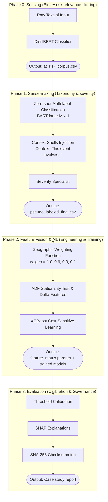

# Schematic Outlines for the 2 Core Diagrams (SOTA V2.0)

This file defines the structure (Nodes) and flows (Edges) for drawing the two most important diagrams in the manuscript. It has been strictly verified against the text in `SCRM_EWS_draft_article_v2.md` to ensure zero hallucinations and 100% terminology alignment.

---

## 1. Research Methodology Framework Diagram (Figure 1)

**Objective:** Visualize the journey from raw data to evaluation, matching Sections 3.2 to 3.6 precisely.
**Recommended Style:** Vertical Flowchart (Top-Down) or Block Diagram.

### Text-Based Visual Reference (Mermaid)
```mermaid
flowchart TD
    subgraph Data_Collection ["Data Collection and Preprocessing (Section 3.2)"]
        A[External Signal: News Corpus<br>GDELT & NewsAPI, 8,728 articles]
        B[(Internal Signal: Operational ERP Data<br>Inventory, POs, Quality, Locations)]
        C[Temporal Alignment<br>Deterministic time-shifting to 2022-2024]
        A --> C
        B --> C
    end

    subgraph Phase_0 ["Phase 0: Sensing Layer (Section 3.3)"]
        D[Manual Annotation<br>2,309 articles]
        E[Binary Risk Filtering<br>DistilBERT + CrossEntropyLoss]
        F{{[QUALITY GATE 1]<br>Fleiss' Kappa = 0.785<br>Cohen's Kappa = 0.635}}
        D --> E --> F
    end

    subgraph Phase_1 ["Phase 1: Sense-making Layer (Section 3.4)"]
        G[Ontology-Anchored Taxonomy Classification<br>Zero-shot Multi-label BART-large-MNLI]
        H[Severity Specialist<br>Context Shells]
        G --> H
    end

    subgraph Phase_2 ["Phase 2: Feature Fusion and ML (Section 3.5)"]
        I[Entity Extraction & Geographic Mapping<br>spaCy NER + Geographic Weighting]
        J[Feature Matrix Construction<br>ADF Test + Delta Features]
        K[Ablation Design<br>Tier 1, Tier 2, Tier 3 Models]
        I --> J --> K
    end

    subgraph Phase_3 ["Phase 3: Evaluation and Data Governance (Section 3.6)"]
        L[Chronological Hold-out Split &<br>Threshold Calibration F0.5]
        M[Explainability<br>SHAP]
        N{{[INTEGRITY & GOVERNANCE]<br>SHA-256 Checksumming}}
        L --> M --> N
    end

    Data_Collection --> Phase_0
    Phase_0 --> Phase_1
    Phase_1 --> Phase_2
    Phase_2 --> Phase_3
    
    style F stroke:#ff0000,stroke-width:2px,stroke-dasharray: 5 5
    style N stroke:#ff0000,stroke-width:2px,stroke-dasharray: 5 5
```

### Node Descriptions mapped to text:
- **Data Collection (3.2):** Explicitly includes "Temporal Alignment (time-shifting)" directly from Section 3.2.2.
- **Phase 0 (3.3):** Starts with Manual Annotation (2,309 articles), flows to Binary Risk Filtering, ending with the Quality Gate (Kappa scores).
- **Phase 1 (3.4):** Taxonomy Classification (BART-large-MNLI) followed by Severity Specialist (Context Shells). Note: The hallucinated "Time-Series Alignment (ISO Week)" is completely removed because it's not in the draft.
- **Phase 2 (3.5):** Geographic Mapping (using extracted entities), then Feature Matrix Construction (ADF Test, Delta features), ending in Model Ablation (Tier 1-3).
- **Phase 3 (3.6):** Evaluation protocols (Chronological split, F0.5 calibration), Explainability (SHAP), and Data Governance (SHA-256).

---

## 2. Proposed System Architecture Diagram (Figure 2)

**Objective:** Display the internal structure of the Cascading AI model (Table 2).
**Recommended Style:** 4 Stacked Stages/Phases (Matching Table 2 exactly).

### Text-Based Visual Reference (Mermaid)


### Node Descriptions mapped to text (Table 2):
- **Architecture matching:** Rather than using the arbitrary "Stage 1, 2, 3" from previous iterations, this diagram now perfectly reflects the "four-stage linear architecture" and **Table 2** of the manuscript (Phase 0, Phase 1, Phase 2, Phase 3).
- **Geographic Weighting (3.5.1):** Accurately includes the 4 defined constants: `1.0 (same country)`, `0.6 (same region)`, `0.3 (global/geopolitical)`, `0.1 (remote)`.
- **Context Shells (3.4.2):** Accurately reflects the textual prompt injection `"Context: This event involves {taxonomy}."`
