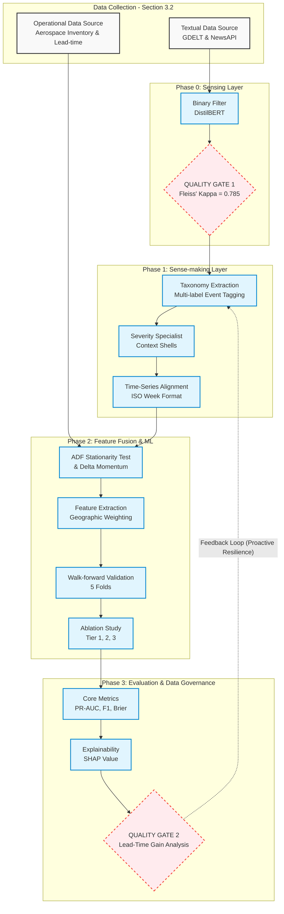
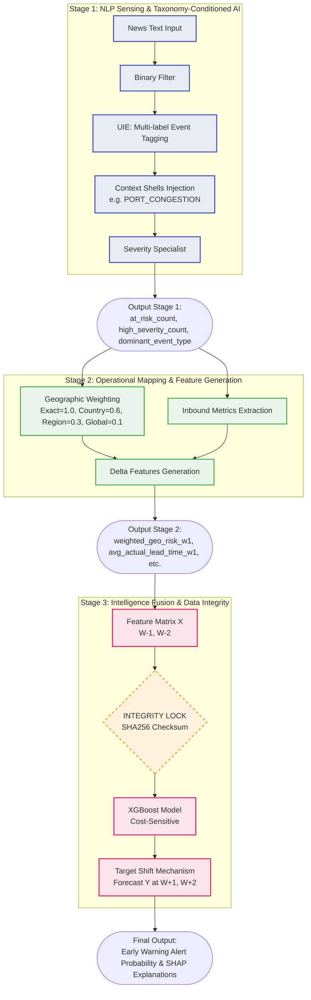

# Schematic Outlines for the 2 Core Diagrams (SOTA V2.0)

This file defines the structure (Nodes) and flows (Edges) for drawing the two most important diagrams in the manuscript. It has been standardized based on the actual V2.0 system and **ensures 100% terminology alignment with the manuscript content**.

---

## 1. Research Methodology Framework Diagram

**Objective:** Visualize the journey from raw data to Actionable Intelligence.
**Recommended Style:** Vertical Flowchart (Top-Down) or Block Diagram.

### Mermaid Visualization

---

## 2. Proposed System Architecture Diagram

**Objective:** Display the internal structure of the 3-Stage AI model (Cascading AI).
**Recommended Style:** 3 Stacked Layers (Stage).

### Mermaid Visualization

